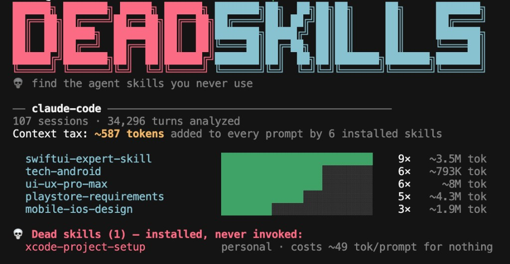

```
██████╗ ███████╗ █████╗ ██████╗ ███████╗██╗  ██╗██╗██╗     ██╗     ███████╗
██╔══██╗██╔════╝██╔══██╗██╔══██╗██╔════╝██║ ██╔╝██║██║     ██║     ██╔════╝
██║  ██║█████╗  ███████║██║  ██║███████╗█████╔╝ ██║██║     ██║     ███████╗
██║  ██║██╔══╝  ██╔══██║██║  ██║╚════██║██╔═██╗ ██║██║     ██║     ╚════██║
██████╔╝███████╗██║  ██║██████╔╝███████║██║  ██╗██║███████╗███████╗███████║
╚═════╝ ╚══════╝╚═╝  ╚═╝╚═════╝ ╚══════╝╚═╝  ╚═╝╚═╝╚══════╝╚══════╝╚══════╝
               find the agent skills you never use
```

Every installed skill adds its name and description to every prompt you send. That cost is paid on every message, whether the skill gets used or not. `deadskills` reads your local transcripts and shows which skills earn their seat, and which ones are probably safe to remove.

[](https://www.npmjs.com/package/deadskills)
[](https://www.npmjs.com/package/deadskills)
[](LICENSE)
[](https://nodejs.org)

## Quick start

**Requires Node 18+.** Auto detects Claude Code (`~/.claude`) and Codex (`~/.codex`) when those directories exist. No config, no login, no telemetry.

```bash
npx deadskills
```

That is the whole workflow. Everything below is reference.



## Install

```bash
npx deadskills               # one-off run, always latest (recommended)
npm install -g deadskills    # global install: run deadskills anywhere
```

From source (development):

```bash
git clone https://github.com/anandsaini18/deadskills
cd deadskills
make install && make link    # deadskills on PATH from local build
```

Zero runtime dependencies. The published package is one ~22 KB file you can read in a sitting.

## Commands

| Command | What it does |
|---------|--------------|
| `deadskills` | Full report for all detected agents |
| `deadskills dead` | List dead skills only |
| `deadskills doctor` | Parse health: are your transcripts being read correctly? |
| `deadskills --since 30d` | Limit analysis to a window (`30d`, `8w`, `6m`, or an ISO date) |
| `deadskills --json` | Machine readable output ([schema](schema/report.schema.json)) |
| `deadskills --agent <name>` | One agent only (name shown in report header) |

```bash
npx deadskills
npx deadskills dead
npx deadskills doctor
npx deadskills --since 30d
npx deadskills --json
npx deadskills --agent <name>
```

## What you learn in one run

1. **Your context tax.** One number for how many tokens your installed skills add to every prompt. The rest of the report exists to help you lower it.
2. **What each skill actually cost you.** Invocation counts from your own transcript history, next to estimated token totals. Grounded in evidence, not vibes.
3. **What to remove.** Dead skills are named with their per prompt cost. They were probably useful once. If the number looks wrong, run `deadskills doctor` and [open an issue](https://github.com/anandsaini18/deadskills/issues/new?template=bug_report.yml).
4. **How much history was read.** Session and turn counts show the report is built from real volume, not a toy demo.
5. **A ranking you can scan in seconds.** Skill names, usage bars, and humanized totals (`~3.5M tok`) so the story is obvious before you read a doc.

## Skill states

| State | Meaning |
|-------|---------|
| active | Invoked at least once. Earning its context seat. |
| zombie | Invoked before, silent for 90+ days |
| dead | Installed, never invoked |

## How it works

1. Discovers installed skills from each agent's skill directories and reads `SKILL.md` frontmatter for name, description, and token cost.
2. Parses session transcripts as JSONL. Skipped lines are counted and surfaced via `doctor`, never silently dropped.
3. Reports per skill invocation counts and token cost (injection cost × turns, plus expansion cost × invocations), then flags dead and zombie skills.

Token figures are estimates (~4 chars/token). They are directionally right, and real cost is usually lower thanks to prompt caching. We label every estimate with a tilde because pretending otherwise would defeat the point of the tool.

Your transcripts never leave your machine. No network calls at runtime.

## Agents

| Agent | Data directory | Status |
|-------|----------------|--------|
| Claude Code | `~/.claude` | Supported |
| Codex | `~/.codex` | Supported |

Both adapters auto detect when their data directories exist. More agents are welcome via PR: one adapter file plus fixtures. See [CONTRIBUTING.md](CONTRIBUTING.md).

## More detail

| Doc | When to read it |
|-----|-----------------|
| [CONTRIBUTING.md](CONTRIBUTING.md) | Adding an adapter or fixing a parser |
| [SECURITY.md](SECURITY.md) | Reporting a vulnerability privately |
| [schema/report.schema.json](schema/report.schema.json) | Building on `--json` output |
| [Issues](https://github.com/anandsaini18/deadskills/issues) | Bugs (paste `doctor` output) or adapter requests |

## Contributing

An adapter is one TypeScript file implementing a three method interface, plus hand written fixtures. Run `make check` to verify, then open a PR. See [CONTRIBUTING.md](CONTRIBUTING.md).

This tool was built to scratch an itch, and it is young. If a number looks wrong on your machine, run `deadskills doctor` and open an issue with the output. It is designed to be safe to paste. Ideas, corrections, and skepticism are all welcome.

## License

MIT. The [report schema](schema/report.schema.json) is CC0, so build on it freely.
